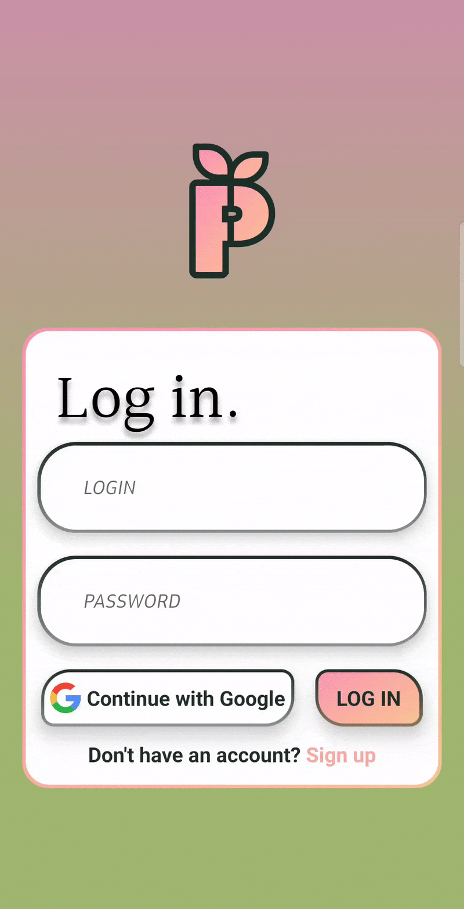

  
  <h1> Planter </h1>

### Table of Contents
* [Intro](#intro)
* [Tech Stack](#tech-stack)
* [Key Features](#key-features)
* [Building the Application Locally](#building-the-application-locally)
* [Future Updates](#future-updates)

## Intro
Planter is a mobile planner designed to help users manage plant care. It's main purpose is to monitor watering frequency and quantity through a system of notifications and intuitive trackers, as well as provide guidance about other plant care parameters such as plant insolation.

## Tech Stack
| Library                                    | Version    | Category          |
|--------------------------------------------|------------|-------------------|
| Expo                                       | 50.0.17    | Framework         |
| React Native                               | 0.73.6     | UI Framework      |
| React Redux                                | 9.1.0      | State Management  |
| Redux Persist                              | 6.0.0      | State Persistence |
| RN Async-Storage                           | 1.21.0     | Storage           |
| Firebase                                   | 19.2.2     | Development Tools |
| Firestore                                  | 19.2.2     | Cloud Database    |
| Google Signin                              | 11.0.0     | Authentication    |
| RN Reanimated                              | 3.6.2      | Animations        |
| Expo Vector Icons                          | 14.0.0     | UI Components     |
| Expo Font                                  | 11.10.3    | Fonts             |
| Expo Localization                          | 14.8.4     | Internationalization |
| Expo Notifications                         | 0.27.7     | Push Notifications |
| RN SVG                                     | 14.1.0     | Graphics          |
| React Navigation                           | 4.4.4      | Navigation        |
| TypeScript                                 | 5.3.0      | Language          |

## Key Features
#### User Authorization
  
Users can register and log in using their email address and password, with an additional layer of security provided by email verification.
Alternatively, users can also sign in using their Google account.

#### Plant Management
  
  
Users can add, edit and delete plants from their collection.  

#### Plant Watering Tracker
  
When users add a new plant to their collection, or edit an existing one, they have the ability to customize the range of days between watering sessions. After each watering session, the system dynamically calculates and updates the next watering date.  

On the scheduled watering day, the application generates a local notification to remind users of the task.  

#### Database Synchronization
User's changes to their plant collection are transferred to a cloud-based database. Upon logging in, the user's plant collection is synchronized with the current state of the database, ensuring consistency across all devices.

## Building the Application Locally
Please note that the code included in this repository is for presentation purposes only. While it provides a glimpse into the structure and logic of the application, it may not be fully functional or up to date with the latest features.

#### Android and iOS configuration
To set up the app for local development, it's crucial to install native packages and configure dependencies to ensure proper functioning and cross-platform compatibility.
It is also recommended to use the latest version of Node.js.

#### Synchronizing with Firebase/Firestore
To ensure the application works as intended, you'll need to synchronize the project with your own Firebase/Firestore instance. This involves creating a Firebase project, configuring Firebase services, and linking the project to Firebase.

## Future Updates
#### Testing with Jest
Planter is currently in the process of implementing thorough testing using Jest to guarantee a stable and bug-free application.

#### User Profile Settings
Implementing settings that will allow the user to adjust profile preferences and manage account details.

#### Calendar Screen
Implementing calendar that will allow the user to keep track of watering schedules.

